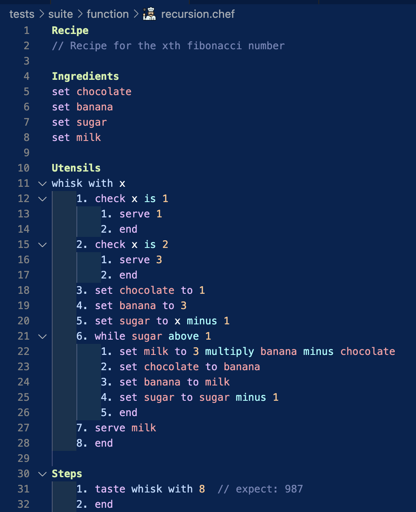

# `chef`

<p align="center"></p>
<h2 align="center"><em>Chef is a stack-based language designed to read like a recipe</em></h2>
</br>

The language was created following completion of Part III of the book [Crafting Interpreters](https://craftinginterpreters.com/), porting the C bytecode interpreter into Rust (the implementation of Lox, with classes, closures etc. can be found on the [lox](https://github.com/D-J-Harris/chef/tree/lox) branch)

In creating a grammar for a recipe-oriented language, I gained deeper insights into Pratt-parsing and stack-based compilation than the first pass through the book. I have written about the interesting challenges and alterations here (_TODO_)


_Recipe for the nth fibonacci number_

## Features

- Function support and basic control flow including if-statements and while-loops ([grammar here](./GRAMMAR.md)) (_TODO incomplete_)
- Syntax highlighting is provided by the VSCode extension `chef-colouring` ([source here](./colouring/)) (_TODO finish and publish_)

## Usage

To build local, clone this repository and build with

```shell
git clone git@github.com:D-J-Harris/chef.git
cargo build --release
```

Run either with zero arguments as a REPL, or compile source code at the `.chef` or `.recipe` extensions

```rust
chef
chef <.chef | .recipe file>
```

## Features Flags

- `--debug_code` - print out each disassembled chunk at the end of compile time
- `--debug_trace` - print out each disassembled operation during runtime

## Test

```sh
cargo test
```

## License

Codebases and references all MIT licensed, including [this repository](./LICENSE)

- [Test and benchmark files](./tests/suite/) adapted from the [book](https://github.com/munificent/craftinginterpreters)
- [Test suite runner code](./tests/run.rs) inspired from [loxido](https://github.com/ceronman/loxido/tree/unsafe)

[Icon](./assets/icon_128x128.png) by [tulpahn, on Freepik](https://www.freepik.com/icon/chef_3808474)
